# Average Face

The function of this tool is to generate the average face of a bunch of faces.

Environment:

```
dlib
opencv-python
```

## 1. What's the concept of average face?

Thanks to Satya Mallick's blog: [https://learnopencv.com/average-face-opencv-c-python-tutorial/](https://learnopencv.com/average-face-opencv-c-python-tutorial/)

## 2. Requriments

```shell
cmake==3.22.0
numpy==1.21.4
scikit-image==0.19.0
dlib==19.22.1
opencv-python==4.5.4.60
```

Note: only support opencv version 4, other version need to rectify the function `cv2.estimateAffinePartial2D` in file `face_average.py`.

## 3. Usage

Please see file [tutorial.ipynb](./tutorial.ipynb) for more details.

## 4. Visulization Results

test images:

| | | |
|-------|---------------|-----|
|  |  |  |
|  |  |  |

average image:

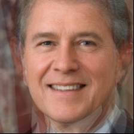

## 5. example for vggface2 

calculate the average face of dataset vggface2

first, calculate the landmark:

```shell
python vggface2landmark.py \
    --image-dir VGGFace2/train/ \
    --save-dir VGGFace2/
```

calculate each people average face

```shell
python vggface2averageface.py \
    --image-dir VGGFace2/train/ \
    --landmark-dir VGGFace2/ \
    --size 224 \ 
    --save-dir results/VGGFace2/
```

then, you will get several average face like:

| | | |
|-------|---------------|-----|
| 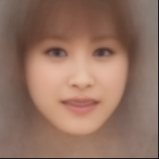 | 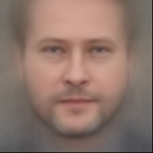 | 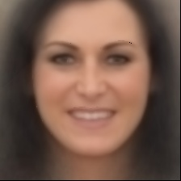 |
| 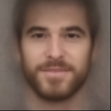 | 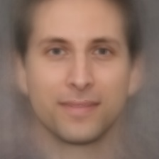 | 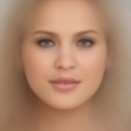 |
| 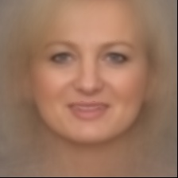 | 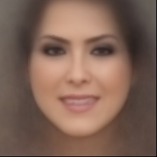 |  |


## 6. Get the average face of a dataset

final, calculate the average face from the various people's average faces:

|VGGFace2-all|VGGFace2-Female|VGGFace2-Male|
|-|-|-|
|  | 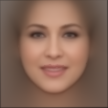 | 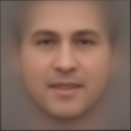 |

|CelebA-all|CelebA-Female|CelebA-Male|
|-|-|-|
|  | 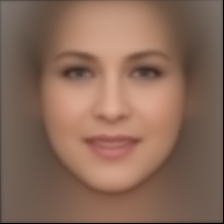 | 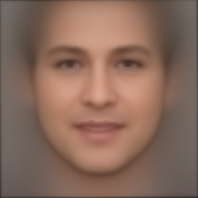 |


```shell
python dataset_face_average.py\
    --image-dir results/VGGFace2-Male\
    --save-dir ./results/VGGFace-male.png
```

## Acknowledge

This code is build from [Naurislv](https://github.com/Naurislv)'s project: [https://github.com/Naurislv/facial_image_averaging](https://github.com/Naurislv/facial_image_averaging)