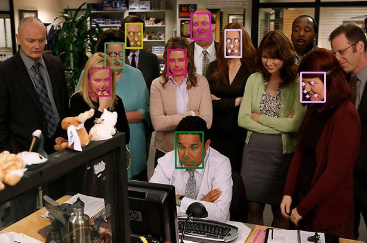
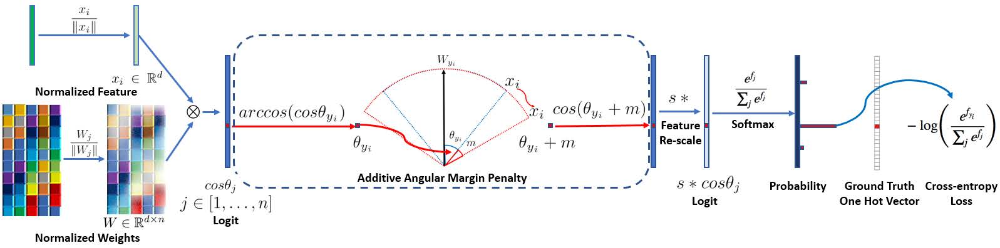

# Face Recognition

This is a pytorch-based face recognition code implementation.

I highly recommend the insightFace project: [https://github.com/deepinsight/insightface/](https://github.com/deepinsight/insightface/)

Here I only provide a set of simple implementation, trying to explain the general face recognition algorithm training process.

## 0. Download

Please download the fold `pretrained`

BaiduYunPan: [https://pan.baidu.com/s/1DmZLydjb3ARQSVUmndnbGA](https://pan.baidu.com/s/1DmZLydjb3ARQSVUmndnbGA)

Extract Code: waak

## 1. What's face recognition?

Face recognition tasks are similar to classification tasks. When give you a face, the face recognition network need to recognize the identity of the face ID.

Usually we also called face identification, usually mean the rank-1 face identification accuracy.

## 2. Processing of Face Identification

### 2.1 Face Detection

First, we need to detect a face in the image, usually we will use **MTCNN** to detect the bounding box of the face and the landmark. For more details about the face detection algorithm **MTCNN** is described in

[Joint Face Detection and Alignment using Multi-task Cascaded Convolutional Networks](https://arxiv.org/abs/1604.02878).

The official MTCNN is here: [https://github.com/kpzhang93/MTCNN_face_detection_alignment](https://github.com/kpzhang93/MTCNN_face_detection_alignment)

I recommand two implementation, one is TensorFlow base: [https://github.com/ipazc/mtcnn](https://github.com/ipazc/mtcnn);
Another is PyTorch based: [https://github.com/TropComplique/mtcnn-pytorch](https://github.com/TropComplique/mtcnn-pytorch)

Because we use PyTorch framework, so I offer a tool in this project.

Please see [tutorial_face_detect_landmark.ipynb](./tutorial_face_detect_landmark.ipynb) for more details.

An example:

|   |   |
|---|---|
|||
|||

### 2.2 Face Alignment

Face alignment is crutial for face identification.

Please see [tutorial_face_alignment.ipynb](./tutorial_face_alignment.ipynb) for more details.

An example:


## 3. Face Recognition

I recommand two popular method:

CosFace: [Hao Wang, Yitong Wang, Zheng Zhou, Xing Ji, Dihong Gong, Jingchao Zhou, Zhifeng Li, Wei Liu; Proceedings of the IEEE Conference on Computer Vision and Pattern Recognition (CVPR), 2018, pp. 5265-5274
](https://openaccess.thecvf.com/content_cvpr_2018/html/Wang_CosFace_Large_Margin_CVPR_2018_paper.html)

ArcFace: [Jiankang Deng, Jia Guo, Niannan Xue, Stefanos Zafeiriou; Proceedings of the IEEE/CVF Conference on Computer Vision and Pattern Recognition (CVPR), 2019, pp. 4690-4699](https://openaccess.thecvf.com/content_CVPR_2019/html/Deng_ArcFace_Additive_Angular_Margin_Loss_for_Deep_Face_Recognition_CVPR_2019_paper.html)

As for ArcFace:



There is no special, only add loss function on it.

During training:

`ArcFace` = `ResNet-101` + `Additive Angular Margin Penalty` + `Feature Re-scale` + `Softmax`

Inference stage:

`ArcFace` = `ResNet-101` + `Softmax`

the implementation of `ArcFace` and `CosFace` please see [models/metrics.py](models/metrics.py).

## 4. Train the model.

I give a example on VGGFace2 dataset.

First, give a path, which conclude all the images that have been aligned, like this:


Then, generate a list, such as:

```shell
n000002/0327_01.jpg 0
n000002/0018_03.jpg 0
n000002/0262_01.jpg 0
n000002/0185_01.jpg 0
n000002/0107_01.jpg 0
n000002/0020_01.jpg 0
n000002/0144_01.jpg 0
n000002/0161_01.jpg 0
n000002/0204_04.jpg 0
n000002/0223_01.jpg 0
n000002/0163_01.jpg 0
n000002/0270_01.jpg 0
```

as the format: `<image path> <ID>`.

Then, train the network:

```shell
python train.py \
    --dataset-root VGGFace2/train_align \
    --train-list   data/train.txt \
    --val-list     data/val.txt \
    --num-classes  8631 \
    --backbone     resnet50 \
    --pre-trained  pretrained/ms1mv3_arcface_r50_fp16/backbone.pth \
    --metric       arcface \
    --device       cuda
```

More details please read carefully.

## 5. Evidential Deep Learning for Face Recognition

```python
python evidential_learning.py
```

Uncertainty distribution


