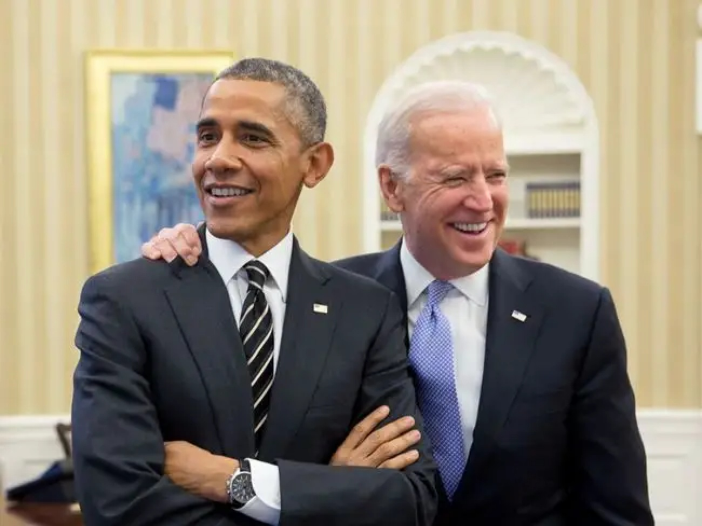
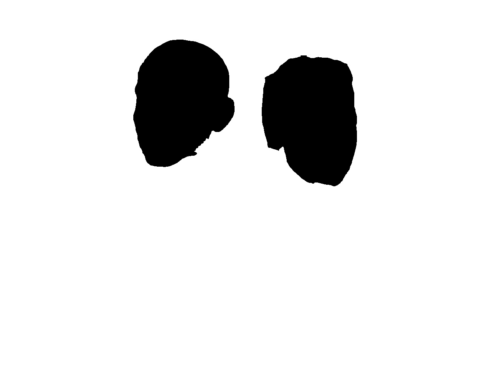
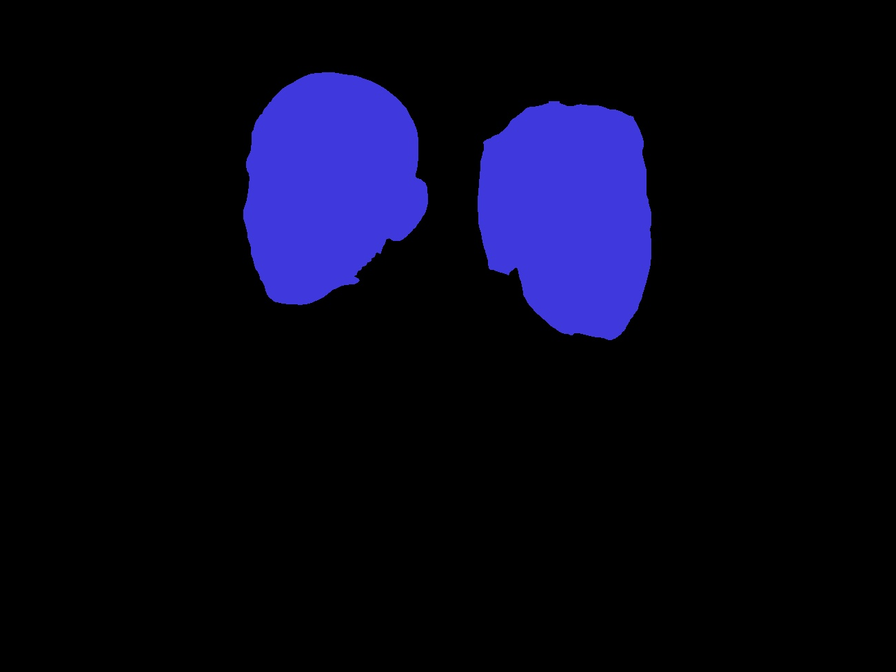

## Face Segmentation

We want to segment all the faces in a photo:



Please download the checkpoint.

```
sh download_ckpt.sh
```

First, detect all the faces


Second, generate the mask

|Segementation Result | Mask |
|-|-|
|||

Segmentation Result:

