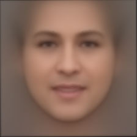
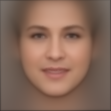
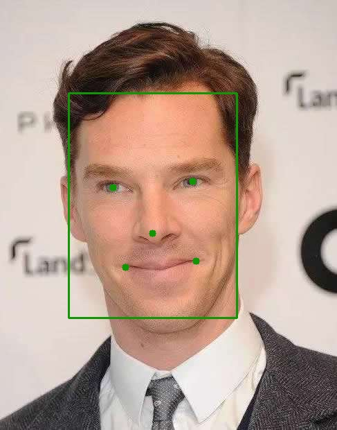
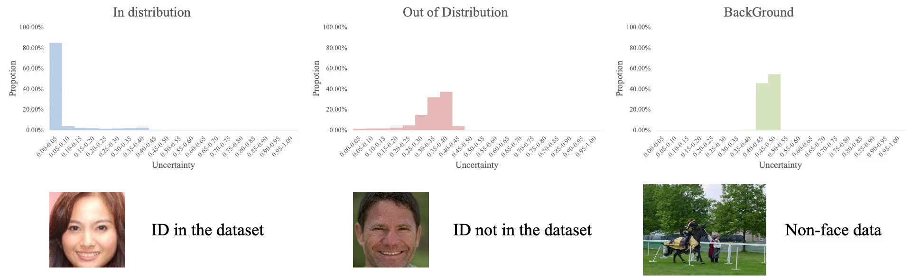
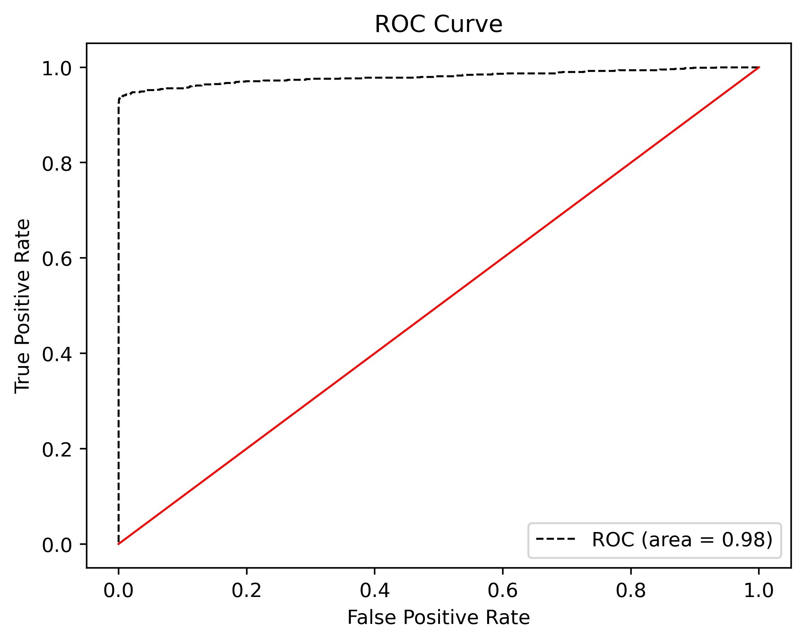
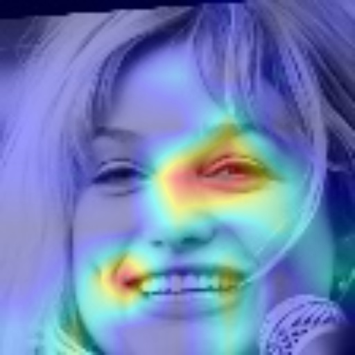
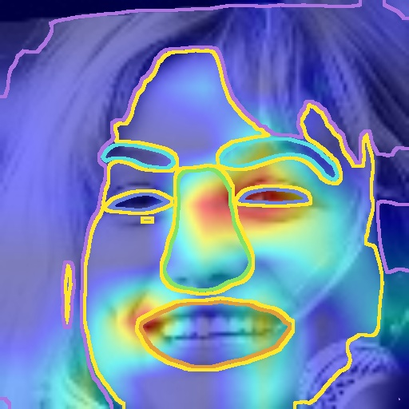

# Face Technology Tool


A collection of code commonly used to process face technology.

Note that this is not the most optimal or state-of-art demo.

## Security

[](https://www.murphysec.com/accept?code=57f251056a8e7c8b5ce36469616a681d&type=1&from=2&t=2)

## 1. Average Face

Compute the average face of a set of face images or face datasets

| VGGFace2 | Celeb-A |
| - | - |
|||

## 2. Face Recognition

Face alignment

|   |   |
|---|---|
|||

Support loss:

- softmax
- arcface
- cosface
- focal loss

we also support evidential deep learning for face recognition



## 3. Face Verification

AUC is often used as an evaluation index in face verification.

```
+--------+--------+--------+--------+--------+--------+--------+--------+--------+--------+--------+
| 1e-06  | 1e-05  | 0.0001 | 0.001  |  0.01  |  0.1   |  0.2   |  0.4   |  0.6   |  0.8   |   1    |
+--------+--------+--------+--------+--------+--------+--------+--------+--------+--------+--------+
| 0.9251 | 0.9251 | 0.9251 | 0.9331 | 0.9421 | 0.9570 | 0.9710 | 0.9780 | 0.9870 | 0.9940 | 1.0000 |
+--------+--------+--------+--------+--------+--------+--------+--------+--------+--------+--------+
ROC AUC: 0.9800934433250592
```




## 4. Grad-CAM

Visualization the model results.

| image | Grad-CAM | Part Score | Edge |
| - | - | - | - |
|  |  |  |  |

## 5. Segmentation


